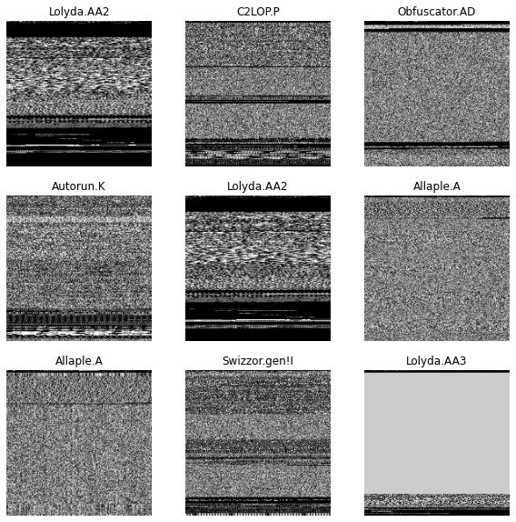
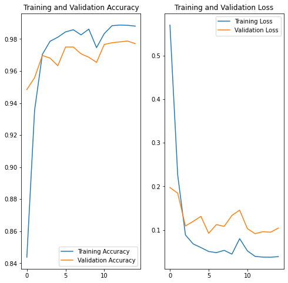
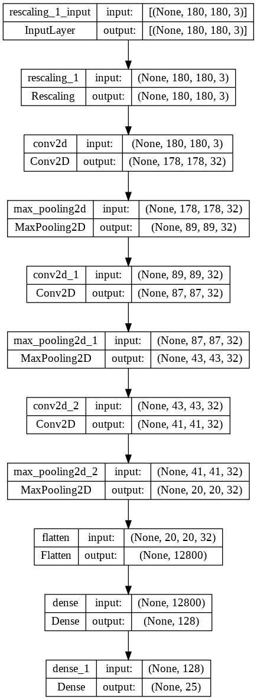
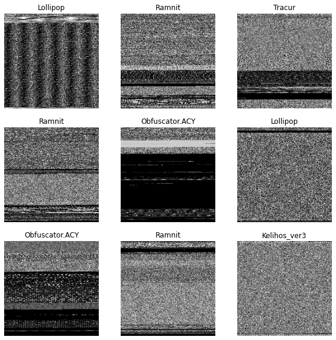
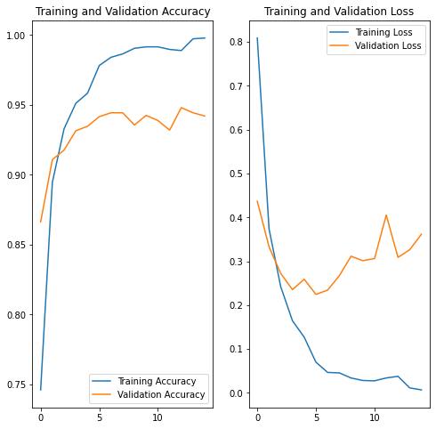

# Archived Results

These figures and metrics come from the saved outputs of the original university final-project notebooks. They document the historical class-project runs and were not regenerated during the GitHub cleanup. The cleaned notebooks improve configuration and evaluation and add dropout, so a new run may produce different numbers.

## Experimental setup

| Dataset | Split used in the archived run | Classes | Image size | Batch size | Epochs |
|---|---:|---:|---:|---:|---:|
| Malimg | 7,521 training / 1,880 validation (80/20 split, seed 123) | 25 | 180 × 180 | 32 | 15 |
| Microsoft BIG 2015 | 8,684 training / 2,176 evaluation | 9 | 180 × 180 | 32 | 15 |

The original model used pixel rescaling followed by three convolution-and-max-pooling blocks, a 128-unit dense layer, and a logits output layer. It was trained with Adam and sparse categorical cross-entropy.

## Malimg

| Metric | Archived result |
|---|---:|
| Best validation accuracy | 97.87% |
| Best validation loss | 0.0914 |
| Final training accuracy | 98.80% |
| Final validation accuracy | 97.71% |
| Final validation loss | 0.1043 |

The validation accuracy stayed near 97–98% late in training, with some fluctuation in validation loss.

## Microsoft BIG 2015

| Metric | Archived result |
|---|---:|
| Best validation accuracy | 94.81% |
| Best validation loss | 0.2245 |
| Final training accuracy | 99.79% |
| Final validation accuracy | 94.21% |
| Final validation loss | 0.3618 |

The widening gap between training and validation performance, together with the rising validation loss after roughly epoch 6, suggests overfitting. Early stopping, data augmentation, and stronger regularization would be sensible follow-up experiments.

## What is intentionally omitted

- The original confusion-matrix attempts are not shown because their evaluation logic was incorrect. The cleaned notebooks replace that logic with deterministic validation ordering, full-dataset predictions, a classification report, and a normalized confusion matrix.
- Raw epoch logs, warnings, notebook arrays, and Colab/Google Drive paths are omitted because they do not add portfolio value.
- Datasets and trained model files are not distributed in this repository.

## Reproducibility note

The archived figures are evidence of the original final-project run, not a benchmark claim. Exact results depend on the dataset copy, image-conversion process, split, software versions, and random initialization. Use the notebooks and setup instructions in this repository to perform and document a fresh run.
