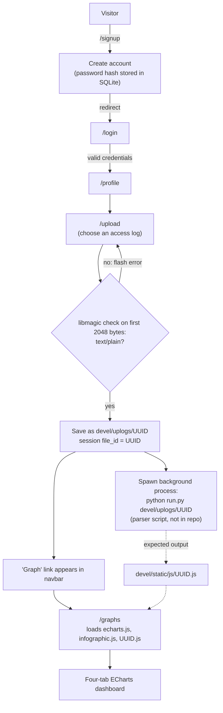

# Weblogs: Apache Access Log Visualizer

Weblogs is a Flask web application for analyzing web server access logs in the browser. Registered users sign in, upload an Apache access log, and view an interactive dashboard of [Apache ECharts](https://echarts.apache.org/) charts covering requests over time, HTTP status codes and methods, IP activity, 404 responses, exponentially smoothed traffic series, and points flagged with a "suspicion score". The repository has the web front end (authentication, upload, dashboard). The log-parsing step that builds each dashboard's dataset is referenced in the code but not included, so this is a working prototype, not a finished product (see [Project status](#project-status-and-known-limitations)).

---

## Table of contents

- [How it works](#how-it-works)
  - [Architecture](#architecture)
  - [Request flow](#request-flow)
  - [Routes](#routes)
  - [Database schema](#database-schema)
  - [How logs are stored and displayed](#how-logs-are-stored-and-displayed)
  - [Dashboard dataset format](#dashboard-dataset-format)
  - [Dashboard tabs and charts](#dashboard-tabs-and-charts)
- [File-by-file reference](#file-by-file-reference)
- [Project status and known limitations](#project-status-and-known-limitations)
- [Requirements](#requirements)
- [Running locally](#running-locally)
- [Repository notes](#repository-notes)
- [Author](#author)

---

## How it works

### Architecture

| Layer | Technology | Where |
|---|---|---|
| Web framework | Flask, application-factory pattern (`create_app()`) | `devel/__init__.py` |
| Routing | Two Flask blueprints: `auth` (accounts) and `main` (app features) | `devel/auth.py`, `devel/main.py` |
| Authentication | Flask-Login (session-based login, "remember me", `@login_required`) | `devel/__init__.py`, `devel/auth.py` |
| Password hashing | Werkzeug `generate_password_hash` / `check_password_hash` | `devel/auth.py` |
| Persistence | Flask-SQLAlchemy on SQLite (`sqlite:///db.sqlite`) | `devel/__init__.py`, `devel/models.py` |
| Upload validation | `python-magic` (libmagic) MIME sniffing | `devel/main.py` |
| Templates / UI | Jinja2 templates styled with Bulma 0.7.2 (loaded from cdnjs) | `devel/templates/` |
| Charts | Apache ECharts 5.3.3 plus the `infographic` theme, served as static files | `devel/static/js/`, `devel/templates/graphs.html` |

At startup, `create_app()`:

1. Creates the Flask app and sets `secret_key` from the `FLASK_SECRET_KEY` environment variable, falling back to the placeholder `"change-me"` (see [Running locally](#running-locally)).
2. Sets `UPLOAD_FOLDER = "devel/uplogs/"` and the SQLite database URI.
3. Initializes SQLAlchemy and a `LoginManager` whose `login_view` is `auth.login`, so unauthenticated users are redirected to the login page.
4. Registers the `auth` and `main` blueprints.
5. Calls `db.create_all()` inside an application context, so the `user` table is created automatically on first run.
6. Registers a `user_loader` that loads the logged-in user by primary key.

### Request flow



### Routes

| Route | Methods | Login required | Handler | Behavior |
|---|---|---|---|---|
| `/` | GET | No | `main.index` | Landing page with the app title and tagline. Also prints the current session's `file_id`, if any. |
| `/signup` | GET | No | `auth.signup` | Sign-up form (email, name, password). |
| `/signup` | POST | No | `auth.signup_post` | If the email already exists, flashes a message and redirects back. Otherwise creates a `User` with the password hashed (`method='sha256'`) and `active=True`, then redirects to `/login`. |
| `/login` | GET | No | `auth.login` | Login form with a "Remember me" checkbox. |
| `/login` | POST | No | `auth.login_post` | Looks up the user by email and verifies the password hash. On failure, flashes an error and reloads the form. On success, calls `login_user(user, remember=...)` and redirects to `/profile`. |
| `/logout` | GET | Yes | `auth.logout` | Logs out, removes `file_id` from the session, redirects to `/`. |
| `/profile` | GET | Yes | `main.profile` | "Welcome, *name*!" page. |
| `/upload` | GET, POST | Yes | `main.upload_site` | GET shows the upload form. POST validates and stores the file and starts background processing (details [below](#how-logs-are-stored-and-displayed)). |
| `/graphs` | GET | Yes | `main.gen_graphs` | Renders `graphs.html` with `data = session["file_id"]`, which selects the dataset script `static/js/<file_id>.js`. |
| `/logs/` | GET, POST | Yes | `main.read_logs` | JSON endpoint. Takes a `date` value (query string on GET, form field on POST) in `DD/Mon/YYYY:HH:MM` form and returns `{"logs": [...]}` with every raw line of `devel/uplogs/access_log` whose timestamp falls in that minute. |

The navigation bar (`menu.html`) changes with state. Anonymous users see **Home / Login / Sign Up**. Authenticated users see **Home / Profile / Upload log / Logout**, plus **Graph** once the session holds a `file_id`.

**Example `/logs/` request:**

```
GET /logs/?date=24/Sep/2022:03:47
```

The handler splits each log line on whitespace and takes field 4 (for example `[24/Sep/2022:03:47:12`). It drops the leading `[` and the trailing `:SS` seconds and compares the result to `date`. This matches the Apache Common/Combined Log Format timestamp.

### Database schema

The only table is `user`, defined in `devel/models.py`. It mixes in Flask-Login's `UserMixin`.

| Column | Type | Constraints | Notes |
|---|---|---|---|
| `id` | `Integer` | Primary key | Used by the Flask-Login `user_loader` |
| `email` | `String(100)` | Unique | Login identifier |
| `password` | `String(100)` | | Werkzeug password hash, never plaintext |
| `name` | `String(250)` | | Shown on the profile page |
| `active` | `Boolean` | | Set to `True` on sign-up |

Uploaded logs and their analysis results are **not** stored in the database. They live on disk, as described next.

### How logs are stored and displayed

1. **Validation.** `allowed_file()` reads the first 2048 bytes of the upload and asks libmagic for its MIME type. Anything other than `text/plain` is rejected with an "Unsupported file format" message. The stream is then rewound. The handler also rejects requests with no file part or an empty filename.
2. **Storage.** The file is saved to `devel/uplogs/` under a generated `uuid.uuid1()` name, not the user's original filename. This avoids filename collisions and path-traversal problems. The UUID is stored in the Flask session as `file_id`, so the upload is tied to the browser session, not to the user record. A code comment notes the plan to replace this with a database identifier.
3. **Processing.** The handler starts a detached background process with `subprocess.Popen(["python", "run.py", "devel/uplogs//<uuid>"])` and flashes a success message. **`run.py` is not part of this project.** The dashboard expects it to parse the log and write a JavaScript dataset to `devel/static/js/<uuid>.js`.
4. **Display.** `/graphs` renders `graphs.html`, which loads `echarts.js`, the `infographic.js` theme, and `js/<file_id>.js`. The dataset file defines global variables, and the inline chart scripts read those variables directly.

### Dashboard dataset format

`devel/static/js/data2.js` is a sample of the dataset the dashboard consumes. It covers 286,754 requests from a 24-hour Apache access log, split into 1,439 one-minute buckets. The client IP addresses in the sample are anonymized: all 1,011 of them were consistently replaced with private addresses (`10.0.x.y`), so request counts and per-IP patterns are unchanged. Each variable is a plain global assignment:

| Variable(s) | Shape | Meaning |
|---|---|---|
| `dateDimensions`, `dateData` | `[[date, count], ...]` | Requests per day |
| `sCodesDimensions`, `sCodesData` | `[[status, count], ...]` | Requests per HTTP status code |
| `timeDimensions`, `timeData` | `[[HH:MM, count], ...]` | Requests per minute (time of day) |
| `methodsDimensions`, `methodsData` | `[[method, count], ...]` | Requests per HTTP method (`GET`, `HEAD`, `POST`, `OPTIONS`, `Other`) |
| `ipsPerMinuteDimensions`, `ipsPerMinuteData` | `[[minute, ips, requests, repeated, 404s], ...]` | Combined per-minute record |
| `smoothIpsPerMinuteDimensions`, `smoothIpsPerMinuteData` | `[[minute, value], ...]` | Smoothed IPs per minute (defined but not used by the template) |
| `RequestsPerMinuteDimensions`, `RequestsPerMinuteData` | `[[minute, count], ...]` | Requests per minute |
| `MinutesRepeatedReqDimensions`, `MinutesRepeatedReqData` | `[[minute, count], ...]` | Repeated requests per minute |
| `IPsand404Dimensions`, `IPsand404Data` | `[[ip, count], ...]` | Number of 404 responses per client IP |
| `MinutesXAxisData` | `[minute, ...]` | Shared x-axis labels (`DD/Mon/YYYY: HH:MM`) |
| `IPsYAxisData`, `RequestsYAxisData`, `RepeatedRequestsYAxisData`, `YAxis404Data` | `[number, ...]` | Per-minute series aligned with `MinutesXAxisData` |
| `SmoothIPsYAxisData`, `SmoothRequestsYAxisData`, `SmoothRepRequestsYAxisData` | `[number, ...]` | Exponentially smoothed versions of those series. In the sample, each value is `s[t] = s[t-1] + 0.125 * (x[t] - s[t-1])`, with `s[0] = x[0]`. |
| `ratioReqIPData` | `[[minute, ips / requests], ...]` | IP-to-request ratio per minute |
| `ratioReq404Data` | `[[minute, 404s / requests], ...]` | 404-to-request ratio per minute |
| `MarkedPointDataReq`, `MarkedPointData404`, `MarkedPointDataIP` | `[{name: "susScore:N", coord: [minute, value], itemStyle: {color}}, ...]` | ECharts `markPoint` entries that highlight minutes flagged with a suspicion score (`susScore:0` to `susScore:3`) |

### Dashboard tabs and charts

`graphs.html` ("Apache Access Logs Visualizer") has four tab buttons. A small `openPage()` function shows the selected tab and resizes every chart.

| Tab | Charts |
|---|---|
| **Simple graphics** | Logs by dates (bar) · Status Codes by Frequency (bar) · Requests per minute (line) · Amount of requests by HTTP Method (pie) · IPs per minute (line) |
| **Linear graphics** | IPs per minute (area) · Requests per minute (area, with suspicion-score markers) · Repeated requests per minute (area) · 404 responses per minute (area, with suspicion-score markers) · IPs with 404 Status Codes (bar). The time-series charts have zoom sliders and save-as-image tools. |
| **Comparison graphics** | Paired bar charts with average lines: IPs vs. Requests · Requests vs. Repeated Requests · Requests vs. 404s · IPs vs. 404s (all per minute) |
| **Smoothed graphics** | Original vs. exponentially smoothed lines for IPs, Requests, and Repeated Requests per minute · IP-to-Requests ratio per minute · 404-to-Requests ratio per minute |

---

## File-by-file reference

| Path | Description |
|---|---|
| `createdb.py` | Two-line helper that imports `db`, `create_app`, and `models` from the `devel` package and calls `db.create_all()`. It never calls `create_app()` or pushes an application context, so `db.create_all()` fails as written with a "no application / working outside of application context" error. You don't need it, because `create_app()` already creates the tables. |
| `devel/__init__.py` | Application factory: config (secret key, upload folder, SQLite URI), SQLAlchemy and Flask-Login setup, blueprint registration, table creation, and the `user_loader`. |
| `devel/models.py` | The `User` SQLAlchemy model (see [Database schema](#database-schema)). |
| `devel/auth.py` | `auth` blueprint: login and sign-up forms and handlers, logout. |
| `devel/main.py` | `main` blueprint: landing page, profile, upload handling with MIME validation and background processing, dashboard page, and the `/logs/` JSON endpoint. |
| `devel/templates/base.html` | Base layout: Bulma CSS, a full-height hero section, the navbar include, and a `content` block. |
| `devel/templates/menu.html` | Navbar whose links depend on login state and on whether an upload exists in the session. |
| `devel/templates/index.html` | Landing page. |
| `devel/templates/login.html` | Login form with flashed error messages and "Remember me". |
| `devel/templates/signup.html` | Sign-up form with flashed messages and a link to the login page. |
| `devel/templates/profile.html` | Welcome page for the logged-in user. |
| `devel/templates/uploadlog.html` | Multipart file-upload form that lists flashed messages. |
| `devel/templates/graphs.html` | Standalone dashboard page (it does not extend `base.html`) with four tabs and 19 ECharts charts driven by the dataset globals. |
| `devel/static/js/data2.js` | Sample dataset (about 500 KB) in the format described above, with client IPs anonymized to `10.0.x.y` addresses. |
| `devel/static/js/echarts.js` | Third-party: unminified Apache ECharts 5.3.3 build (about 3.3 MB, Apache-2.0 license). |
| `devel/static/js/infographic.js`, `dark.js`, `vintage.js` | Third-party ECharts theme files. Only `infographic.js` is loaded by `graphs.html`. |
| `devel/uplogs/gitit` | Placeholder file (one line of text) that keeps the upload directory in version control. |
| `.gitignore` | Ignores OS files, Python caches, `.env`, `node_modules/`, `vendor/`, and `*.key`. |

---

## Project status and known limitations

This is a development prototype (the package itself is named `devel`). Things to know before running it:

- **Missing log parser.** The upload handler starts `run.py`, which is not in the repository. New uploads therefore never produce the `static/js/<uuid>.js` dataset, and `/graphs` loads without data. `data2.js` shows the expected output format.
- **`/graphs` without an upload.** The view reads `session["file_id"]` directly. Opening `/graphs` before uploading raises a `KeyError`; the menu hides the link in that case.
- **`/logs/` reads a fixed file.** It reads `devel/uplogs/access_log`, not the user's upload, and the file is not included. No template calls this endpoint.
- **Upload ownership.** Uploads are tracked only in the session cookie, not in the database.
- **Chart themes.** Several `echarts.init` calls pass a theme name to `document.getElementById` instead of `echarts.init`, or name themes that are not loaded (`dark`, `vintage`, `infographics`). Those charts use the default ECharts theme.
- **Relative paths.** `UPLOAD_FOLDER` and the `/logs/` file path are relative to the working directory, so start the app from the repository root.
- **Configuration.** The secret key is read from `FLASK_SECRET_KEY`; if that variable is unset, the app silently uses the placeholder `"change-me"`. `app.config['MAX_CONTENT_LENGTH']` (upload size limit) is commented out.

---

## Requirements

There is no `requirements.txt`. These dependencies are inferred from the imports:

| Package | Why | Notes |
|---|---|---|
| Python 3.8+ | Runtime | |
| `Flask` | Web framework | Use `< 3.0` (see Werkzeug) |
| `Werkzeug` | Password hashing, file utilities | **`< 3.0` required**: `generate_password_hash(..., method='sha256')` was removed in Werkzeug 3.0 |
| `Flask-SQLAlchemy` | ORM / SQLite access | |
| `Flask-Login` | Session authentication | |
| `python-magic` | MIME-type detection for uploads | Needs the system **libmagic** library |
| Internet access (browser) | Bulma CSS is loaded from cdnjs | ECharts is served locally |

---

## Running locally

```bash
# 1. From the repository root, create and activate a virtual environment
python3 -m venv .venv
source .venv/bin/activate

# 2. Install the system libmagic library
brew install libmagic            # macOS
# sudo apt-get install libmagic1 # Debian/Ubuntu

# 3. Install Python dependencies
pip install "flask<3" "werkzeug<3" flask-sqlalchemy flask-login python-magic

# 4. Set a secret key for session signing
export FLASK_SECRET_KEY="$(python3 -c 'import secrets; print(secrets.token_hex(32))')"

# 5. Run the development server from the repository root
flask --app devel run --debug
```

Open <http://127.0.0.1:5000/>, sign up, log in, and use **Upload log** to submit a plain-text Apache access log.

Notes:

- Flask finds the `create_app()` factory in the `devel` package automatically. Tables are created on the first start. With Flask-SQLAlchemy 3.x the database file is `instance/db.sqlite`; with 2.x it is `db.sqlite` in the working directory.
- `devel/__init__.py` reads the Flask `secret_key` from the `FLASK_SECRET_KEY` environment variable. If it isn't set, the placeholder `"change-me"` is used, which is fine for a quick local test but must never be used in a deployment.
- Running `createdb.py` is not required and fails as written (see [File-by-file reference](#file-by-file-reference)).

---

## Repository notes

- **Third-party code.** `devel/static/js/echarts.js` is a vendored Apache ECharts build (about 3.3 MB), and `infographic.js`, `dark.js`, and `vintage.js` are vendored ECharts themes. Consider excluding `echarts.js` from version control. `graphs.html` loads it from `devel/static/js/echarts.js`, so if you exclude it, download ECharts 5.3.3's `dist/echarts.js` from the official `echarts` npm package into that folder before running.
- **Sample data.** The client IP addresses in `devel/static/js/data2.js` were anonymized (consistently mapped to `10.0.x.y`), so the sample doesn't expose real visitors' addresses.
- **Generated runtime files** that should not be committed: the SQLite database, uploaded logs, and per-upload datasets. Suggested `.gitignore` additions:

```gitignore
# Virtual environment
.venv/

# SQLite database (Flask-SQLAlchemy 2.x / 3.x locations)
db.sqlite
instance/

# Uploaded logs (keep the placeholder)
devel/uplogs/*
!devel/uplogs/gitit

# Vendored library (download separately, see above)
devel/static/js/echarts.js
```

---

## Author

Jose E. Rodriguez Rios
